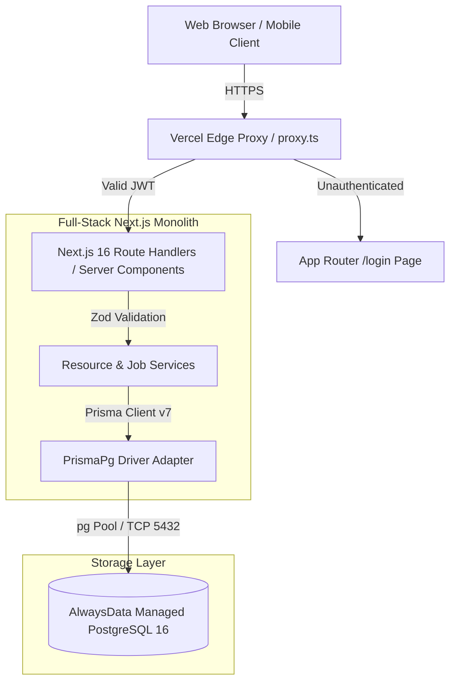
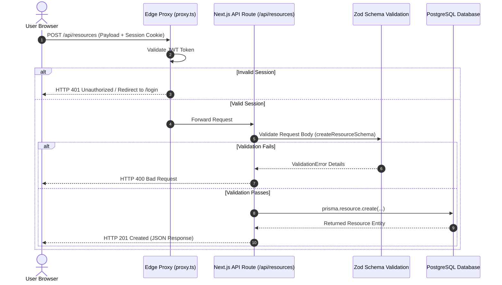
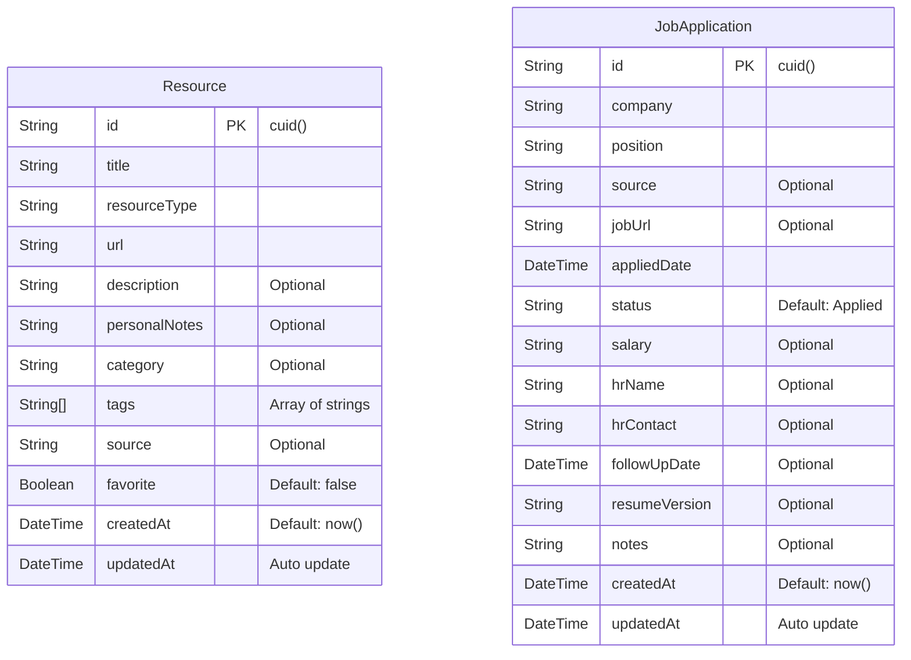

# IMPLEMENTATION.md — Technical Architecture & Implementation Specification

## Project: Personal Productivity Hub (`resource-hub`)
**Architect**: Senior Principal Software Architect & DevOps Lead  
**Version**: 1.0.0  
**Target Environment**: Vercel (Full-Stack Next.js Engine) + AlwaysData (Managed PostgreSQL)

---

## 1. Executive Summary & Core Principles

### 1.1 Purpose & Problem Statement
The **Personal Productivity Hub** is a single-tenant, full-stack application designed to replace fragmented bookmarks, technical documentation screenshots, WhatsApp self-messages, and Excel job tracking spreadsheets with a unified, high-performance knowledge base and job search management platform.

### 1.2 Non-Functional Requirements & Design Principles
- **Single-Tenant Privacy & Zero-Footprint Security**: Engineered strictly for single-user operation. Authentication relies on bcrypt-hashed credentials stored in environment variables, backed by encrypted JWT sessions validated at the edge.
- **Ultra-Low Latency (<100ms)**: Built with Next.js 16 App Router using React Server Components (RSC) to serve initial pages directly from the edge, minimizing client-side JavaScript execution.
- **Resilient Data Access**: Leverages Prisma ORM v7 with the `@prisma/adapter-pg` driver adapter over a connection-pooled PostgreSQL backend, preventing cold-start DB connection exhaustion.
- **Aesthetic Excellence & Accessibility**: Styled with dark-mode glassmorphism, responsive Tailwind CSS layouts, micro-animations, accessible dialogs, and instant visual feedback (toast notifications).

---

## 2. Tech Stack Overview

| Layer | Technology | Version | Rationale |
| :--- | :--- | :--- | :--- |
| **Framework** | Next.js (App Router) | `16.2.12` | Full-stack serverless framework providing RSCs, serverless Route Handlers, edge proxy middleware, and Turbopack bundler. |
| **Language** | TypeScript | `^5.0.0` | Strict static typing across database schemas, API contracts, forms, and client components. |
| **Database** | PostgreSQL | `16.14` | Relational storage hosted on AlwaysData providing ACID compliance, native JSON/array indexing, and full-text search. |
| **ORM** | Prisma ORM | `7.9.1` | Type-safe database queries with explicit model migrations, `PrismaPg` driver adapter integration, and schema-driven type generation. |
| **Authentication** | NextAuth.js (Auth.js) | `^5.0.0-beta` | Edge-compatible session management using JWT strategy with custom Credentials provider and proxy route guard. |
| **Form Management** | React Hook Form | `^7.83.0` | Uncontrolled form performance with minimal re-renders. |
| **Validation** | Zod | `^3.25.76` | Runtime validation for API bodies and client-side forms with inferred TypeScript types. |
| **Styling & UI** | Tailwind CSS + Lucide Icons | `^4.0.0` | Utility-first CSS engine with dark mode variables, glassmorphism utilities, and vector icons. |
| **Feedback / Toast** | Sonner | `^2.0.7` | Non-blocking notifications for instant user feedback on CRUD actions. |

---

## 3. System Architecture & Component Design

### 3.1 High-Level Architecture
The application follows a **Monolithic Full-Stack Serverless Architecture**. Next.js handles incoming HTTP requests via Vercel Edge/Serverless functions. Authenticated requests are routed through `proxy.ts` before reaching Pages or REST API Route Handlers. Data access is centralized in `lib/prisma.ts` using `@prisma/adapter-pg`.



### 3.2 Data Flow & Component Sequence


### 3.3 Architectural Patterns
1. **Full-Stack Monolith (App Router)**: API route handlers and server-rendered UI components reside in a unified repository, sharing TypeScript types and schemas without cross-repository version drift.
2. **Edge Proxy Authorization Guard**: Route protection logic (`proxy.ts`) executes at the edge, rejecting unauthorized requests before serverless handlers or database pools are instantiated.
3. **Singleton Repository / Connection Pool**: `lib/prisma.ts` implements global singleton caching to prevent serverless function hot-reloads from exhausting database connection limits.

---

## 4. Project Directory & Code Structure

```
c:\Users\kiran\Desktop\resource-hub\
├── app/
│   ├── api/                          # REST API Route Handlers
│   │   ├── auth/[...nextauth]/       # NextAuth authentication endpoints
│   │   ├── jobs/                     # Job application endpoints (GET list, POST create)
│   │   │   └── [id]/                 # Individual job endpoints (GET, PUT, DELETE)
│   │   ├── resources/                # Resource endpoints (GET list, POST create)
│   │   │   └── [id]/                 # Individual resource endpoints (GET, PUT, DELETE)
│   │   └── stats/                    # Aggregate analytics endpoint for Dashboard
│   ├── jobs/                         # Jobs frontend domain
│   │   ├── [id]/page.tsx             # Job application detail view & progress timeline
│   │   └── page.tsx                  # Job application tracker main view
│   ├── resources/                    # Resources frontend domain
│   │   ├── [id]/page.tsx             # Resource detail view
│   │   └── page.tsx                  # Resource hub main view
│   ├── login/                        # Authentication login page
│   ├── generated/prisma/             # Prisma client generated output
│   ├── globals.css                   # Custom global CSS, theme tokens, glass utilities
│   ├── layout.tsx                    # Root layout with Geist font & Client Providers
│   └── page.tsx                      # Dashboard root page (RSC)
├── components/
│   ├── auth/                         # LoginForm component
│   ├── dashboard/                    # StatsCard, RecentResources, RecentApplications, QuickAdd
│   ├── jobs/                         # JobForm, JobFilters, JobStatusBadge, JobListClient
│   ├── resources/                    # ResourceForm, ResourceCard, ResourceFilters, ResourceListClient
│   ├── layout/                       # Sidebar, Header, AppShell container
│   ├── providers.tsx                 # Client context wrappers (SessionProvider, ThemeProvider, Toaster)
│   └── shared/                       # ConfirmDialog, EmptyState, LoadingSkeleton, Pagination, SearchInput
├── hooks/                            # Custom React hooks (useResources, useJobs, useDebounce)
├── lib/
│   ├── constants.ts                  # Domain categories, job statuses, color mappings
│   ├── prisma.ts                     # Prisma v7 singleton with PrismaPg pool adapter
│   └── validations.ts                # Zod schemas for resources and jobs
├── prisma/
│   ├── schema.prisma                 # Declarative database schema definitions
│   └── seed.ts                       # Database seeding script
├── types/                            # Shared TypeScript interfaces (Resource, JobApplication, API responses)
├── utils/                            # Formatting & string transformation helpers (formatDate, truncate)
├── auth.config.ts                    # Edge-safe NextAuth callback & authorization configuration
├── auth.ts                          # Node.js runtime NextAuth setup with Credentials provider
├── prisma.config.ts                  # Prisma 7 CLI configuration file
├── proxy.ts                          # Next.js 16 route protection guard (replaces middleware.ts)
└── next.config.ts                    # Next.js framework configuration
```

---

## 5. Data Model & Database Schema

### 5.1 Entity Relationship Diagram (ERD)



### 5.2 Indexing & Performance Strategy
- **`Resource` Indexes**:
  - `@@index([resourceType])`: Optimizes filtering by category/type.
  - `@@index([favorite])`: Fast retrieval of bookmarked items.
  - `@@index([createdAt])`: Accelerates chronological sorting.
- **`JobApplication` Indexes**:
  - `@@index([status])`: Speeds up dashboard pipeline counts and status-filtered lists.
  - `@@index([appliedDate])`: Optimizes timeline ordering.
  - `@@index([createdAt])`: Speeds up recent applications query.

---

## 6. API & Interface Design

### 6.1 Endpoints Specification

| Endpoint | Method | Authentication | Description | Query Parameters |
| :--- | :--- | :--- | :--- | :--- |
| `/api/auth/[...nextauth]` | `GET/POST` | Public | NextAuth handler for sign-in and session verification | N/A |
| `/api/stats` | `GET` | Required | Returns dashboard counts (resources, applications, pipeline breakdown) | N/A |
| `/api/resources` | `GET` | Required | Paginated list of resources with filters & search | `q`, `type`, `category`, `favorite`, `sort`, `page`, `pageSize` |
| `/api/resources` | `POST` | Required | Create a new resource item | N/A |
| `/api/resources/[id]` | `GET` | Required | Fetch detailed single resource record | N/A |
| `/api/resources/[id]` | `PUT` | Required | Update resource record | N/A |
| `/api/resources/[id]` | `DELETE` | Required | Delete resource record | N/A |
| `/api/jobs` | `GET` | Required | Paginated list of job applications with status filter | `q`, `status`, `sort`, `page`, `pageSize` |
| `/api/jobs` | `POST` | Required | Create a new job application | N/A |
| `/api/jobs/[id]` | `GET` | Required | Fetch single job application record | N/A |
| `/api/jobs/[id]` | `PUT` | Required | Update job application record | N/A |
| `/api/jobs/[id]` | `DELETE` | Required | Delete job application record | N/A |

### 6.2 Standardized API Response Contracts
- **Success Response**:
  ```json
  {
    "data": [ /* payload */ ],
    "meta": {
      "page": 1,
      "pageSize": 12,
      "total": 45,
      "totalPages": 4
    }
  }
  ```
- **Error Response**:
  ```json
  {
    "error": "Validation failed",
    "details": {
      "fieldErrors": {
        "url": ["Must be a valid URL"]
      }
    }
  }
  ```

---

## 7. Technical Trade-offs & Future Considerations

### 7.1 Architecture Trade-offs
1. **Single-Tenant Credentials vs Multi-Tenant OAuth**:
   - *Decision*: Simple single-user credential check via environment variables.
   - *Rationale*: Eliminates external auth provider dependencies (OAuth redirect loops, rate limits) for a personal productivity tool.
2. **Full-Stack Monolith vs Decoupled Microservices**:
   - *Decision*: Next.js App Router monolith with integrated Route Handlers.
   - *Rationale*: Zero latency overhead for API calls, unified TypeScript types, and single-click deployment to Vercel.

### 7.2 Future Expansion Vectors
- **Vector Search Integration**: Incorporate pgvector in PostgreSQL to enable semantic search over personal notes and resource descriptions.
- **Browser Extension**: Build a WebExtension to push active browser tabs directly to `/api/resources` with one click.
